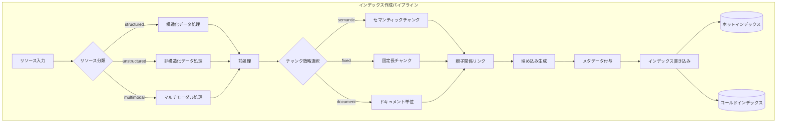

# インデックス作成パイプライン（Indexing Pipeline）

## パイプライン図

## ノード詳細

### リソース入力

対応するデータ形式：

- 構造化・非構造化データ
  - テキストファイル（txt, md, HTML）
  - JSON
  - ログファイル
  - CSV
  - DB（RDB, NoSQL）
  - メール
  - PDF
  - PPT
  - docs
  - Excel
  - URL（外部サイト）
  - Notionなどの外部サービス
  - Slack
- マルチモーダル
  - スクショ
  - 画像
  - 動画
  - 音声
  - Figma, PlantUML, draw.io, Excalidraw

### 前処理

- 初期指示
- マルチモーダルな入力
- ドキュメントのカテゴリ分割
  - 例: 従業員タイプ別に「通勤手当規程_正社員.md」「通勤手当規程_アルバイト.md」と分割
  - 例外規定の埋没を防ぎ、検索精度を根本的に改善
- データ品質対策
  - 重複検出: MinHash + Jaccard距離で同定・除外
  - PII検出: 個人情報のマスキング・除外
  - 毒性フィルタリング: 不適切なコンテンツの除外
  - データ毒盛（Poisoning）対策: 悪意あるデータの検出・フィルタリング

### チャンク分割

- オーバーラップによる文脈分断対策
- メタデータでは管理しきれない部分的な信頼度管理
- チャンクが適用される条件をチャンクのメタデータに持たせる
- ドメイン特有の設計が重要（試験問題なら問題単位、契約書なら条項単位など）
- テキスト正規化で表記揺れを統一
- セマンティックチャンク化の仕組み
  - 隣接チャンク間のコサイン類似度の勾配を計算
  - 類似度が急低下する箇所を境界として分割
  - 計算コストは高いが、文脈を保持した自然な区切りが可能
- 「Lost in the Middle」問題
  - LLMは長い入力の中盤部分の情報活用に苦しむ
  - チャンクを適切なサイズに保ち、関連情報に注意を集中させる

### 埋め込み生成

- 日本語に強いか
  - ruri-v3-310m: 日本語特化、768次元、JMTEBベンチマークでSOTA（平均77.2）
  - 評価指標: JMTEB（日本語テキスト埋め込みベンチマーク）
- マルチモーダルな埋め込み
- 画像を埋め込むか
- Image-to-Textで文字列で埋め込むか
- 専門用語に強いモデル
  - ドメイン特化モデル: Legal-BERT（法律）、BioBERT（医療）など
  - 汎用モデルより特定分野での検索精度が向上
- Fine-tuningを視野に入れる
  - 特定のドメインやデータセットに合わせて調整することで精度向上

### インデックス化

#### 更新に強いインデックス設計

- **Delete-then-Insert（完全置換）**
  - ドキュメント、セクション単位で古いベクトルを全削除してから再チャンク・再埋め込みする

- **Parent Document Retrieval / Small-to-Big**
  - 検索用の「小さなチャンク」と、LLMに渡す「大きな親ドキュメント」を紐付けて管理

- **メタデータの活用（バージョン管理）**
  - ベクトルに「最終更新日時」や「バージョン」のメタデータを付与し、検索時にフィルタリングする
  - マニュアルが複数ある場合など積極的に活用する

- **信頼度管理（フィードバックループによる信頼度管理を反映）**
  - 同じ文章でも検索結果や質問の正解率が異なる場合などにメタデータを活用し解決する
  - 対象部署タグを持ち、問い合わせ時にUserProfileでフィルタ

- **ライフサイクル管理**
  - アーカイブ・削除をするときは注釈用のkey-valueを別に持つ方法もある

#### 更新頻度によりインデックスを分ける

**ホットインデックス（数分に一度更新）**
- 変更監視だけシンプルに更新、チャンク分割もシンプルに
- デルタインデックス（インメモリインデックス）の活用、生データなので全検索になる
- ゴミデータが発生しないようにキャッシュする（TTLの活用）

**コールドインデックス（数日に一度更新）**
- 速度より質を重視
- HNSW, IVFなどのベースインデックス
- 定期バッチでインデックスを作り直す
- チャンク化も影響を付与した高度なものにする

#### インデックスアルゴリズムの選定

| データ規模 | 推奨アルゴリズム |
|-----------|-----------------|
| 数万件まで | IndexFlatIP（全探索） |
| それ以上 | IndexHNSWFlat |

- 本番運用ではQdrantを推奨（メタデータフィルタリング対応）

#### ベクトルDBの選定

- リアルタイム更新とバッチ処理の混在に強いDBを選ぶ
- 書き込みバッファを持ち、バックグラウンドでマージしているElasticsearchやQdrantを選ぶ
- 日本語対応の注意点
  - Qdrantのライブラリは日本語トークン化に未対応、自前実装が必要
  - 日本語トークナイザー: Sudachi
