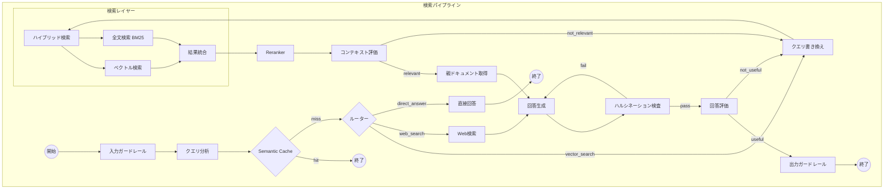

# 検索パイプライン（Query Pipeline）

## パイプライン図

## ノード詳細

### クエリ分析

- メタデータ活用時に必要なUserProfileなどもここで取得

### Semantic Cache（意味的キャッシュ）

- 過去の質問と意味的に類似している場合、キャッシュから即座に回答を返す
- LLM呼び出しや検索をスキップし、APIコストとレイテンシを大幅に削減
- 実装例: GPTCache

### ガードレール

- 入力ガードレール: 不正なクエリ、プロンプトインジェクションの検出
- 出力ガードレール: 機密情報の除去、不適切な回答のフィルタリング
- 実装アプローチ
  - LLMベース（NeMo Guardrails）
  - 埋め込みベース（Semantic Router）
  - ルールベース（Presidio等でPII検出）

### ルーター

- 構造化条件と定性的要望で検索手法を分ける
  - 構造化条件（「科目は英語」など）→ DB検索 / メタデータフィルタ
  - 定性的要望（「説明が丁寧」など）→ ベクトル検索

### クエリ書き換え

- HyDE（Hypothetical Document Embeddings）: 仮想的な回答を生成してから検索
  - 精度向上に有効だが、速度とのトレードオフがある
- メタデータ抽出: LLMでクエリからタグや検索条件を抽出し、フィルタリングに活用
  - 自然言語から構造化された検索条件を自動生成

### ハイブリッド検索

- 複数インデックス対応
- ホットインデックス内でも鮮度のスコアをつける
- 密ベクトルと疎ベクトルの組み合わせ
  - 密ベクトル: 埋め込みモデルで生成、意味的な類似性を捉える
  - 疎ベクトル: キーワード出現頻度で生成（BM25的）、キーワード一致を捉える
  - 密ベクトルのみだとキーワードが異なる結果を返す問題がある（例：「ボタンA」と「ボタンB」の区別ができない）
- Embedding検索の限界
  - 固有名詞やドメイン固有語はEmbedding空間上で十分な意味的特徴を持たない
  - 一般的な概念に近づいてしまうため、BM25で補完が必要
- ハイブリッド検索の適用判断
  - 向いている: 社内システム名、製品名、専門用語が多いケース
  - 向いていない: 一般用語中心のFAQ、高速レスポンスが最優先のケース
- 検索の役割分担
  - Retriever: Recall重視（広く取得）
  - Reranker: Precision重視（絞り込み）

### ベクトル検索

- 類似度計算
  - コサイン類似度
- 評価指標
  - MRR（平均逆順位）
  - Recall@5
- 運用上の課題
  - 類似度閾値の設定が困難（適切な閾値が事前に決められない）
  - クエリごとに類似度分布が不均一
  - モデル変更時にパラメータ再調整が必要

### 全文検索

- 検索モデル
  - BM25

### 結果統合

- RRF（Reciprocal Rank Fusion）: 複数の検索手法の結果を統合するアルゴリズム
  - 異なるスコア尺度（ベクトル類似度、BM25スコア）を正規化して統合

### 検索結果の取りまとめ（Reranking）

- Rerankingモデル
  - Cross-encoderモデル（例: bge-reranker-large）
  - コスト・レイテンシとのトレードオフがある
- Rerankingにより情報の優先度をつける
- ホットインデックスをコールドより優先させるなど
- 古い情報をどこまで受け入れるか
- 類似の矛盾するデータソースの扱い
- 注意: Rerankingは「ノイズ除去」には有効だが「検索漏れ」には対応できない
  - Recall（再現率）の問題にRerankingを適用すると逆効果になる場合がある
  - 初期検索の品質向上が先決

### コンテキスト評価

- 取得したドキュメントの関連性を評価
- 関連性なしの場合の選択肢
  - クエリ書き換えて再検索
  - Web検索へフォールバック（CRAG: Corrective RAG）

### 回答

- 参照元資料のURLやパスの表示
- Generative UIによる柔軟な表示
- 現在の会話のセッション管理
- 過去の会話を記録してパーソナライズ
- 古い情報や誤った情報を検知するためのフィードバックループ
  - Rerankingへメタデータに活用
  - Good/Badボタンと理由
  - 今後は選択肢を選択し、「これが違う」などと入力できるように
  - 正しい情報を入力できるように
  - フィードバックはDB管理して手動で文書を見直す動線とする
- フィードバックの活用方法
  - Golden Dataset: Bad評価をテストケースとして蓄積し、プロンプト改善やReranker選定に使用
  - Few-Shot Prompting: Good評価のQ&Aを別ストアにベクトル化して保存し、類似質問時にプロンプトへ動的注入（In-Context Learning）
- 評価
  - RAGAS
  - Langfuse
