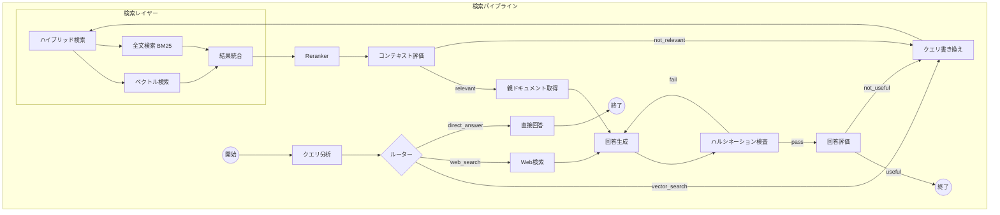

# 検索パイプライン（Query Pipeline）

## パイプライン図

## ノード詳細

### ユーザ操作

- メタデータ活用時に必要なUserProfileなどもここで取得

### 対インデックスな検索

- 複数インデックス対応
- ホットインデックス内でも鮮度のスコアをつける

### ベクトル検索

- 検索アルゴリズム
  - ベクトル類似度検索
- 評価指標
  - MRR（平均逆順位）
  - Recall@5
  - コサイン類似度

### 全文検索

- 検索モデル
  - BM25

### 検索結果の取りまとめ（Reranking）

- Rerankingモデル
- Rerankingにより情報の優先度をつける
- ホットインデックスをコールドより優先させるなど
- 古い情報をどこまで受け入れるか
- 類似の矛盾するデータソースの扱い

### 回答

- 参照元資料のURLやパスの表示
- Generative UIによる柔軟な表示
- 現在の会話のセッション管理
- 過去の会話を記録してパーソナライズ
- 古い情報や誤った情報を検知するためのフィードバックループ
  - Rerankingへメタデータに活用
  - Good/Badボタンと理由
  - 今後は選択肢を選択し、「これが違う」などと入力できるように
  - 正しい情報を入力できるように
  - フィードバックはDB管理して手動で文書を見直す動線とする
- 評価
  - RAGAS
  - Langfuse
