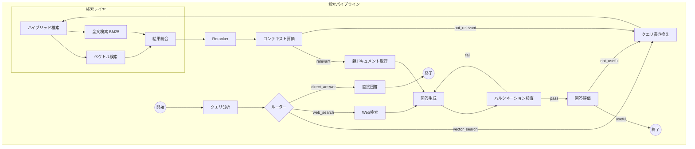

# 検索パイプライン（Query Pipeline）

## パイプライン図

## ノード詳細

### クエリ分析

- メタデータ活用時に必要なUserProfileなどもここで取得

### ルーター

- 構造化条件と定性的要望で検索手法を分ける
  - 構造化条件（「科目は英語」など）→ DB検索 / メタデータフィルタ
  - 定性的要望（「説明が丁寧」など）→ ベクトル検索

### クエリ書き換え

- HyDE（Hypothetical Document Embeddings）: 仮想的な回答を生成してから検索
  - 精度向上に有効だが、速度とのトレードオフがある

### ハイブリッド検索

- 複数インデックス対応
- ホットインデックス内でも鮮度のスコアをつける

### ベクトル検索

- 類似度計算
  - コサイン類似度
- 評価指標
  - MRR（平均逆順位）
  - Recall@5

### 全文検索

- 検索モデル
  - BM25

### 結果統合

- RRF（Reciprocal Rank Fusion）: 複数の検索手法の結果を統合するアルゴリズム
  - 異なるスコア尺度（ベクトル類似度、BM25スコア）を正規化して統合

### 検索結果の取りまとめ（Reranking）

- Rerankingモデル
- Rerankingにより情報の優先度をつける
- ホットインデックスをコールドより優先させるなど
- 古い情報をどこまで受け入れるか
- 類似の矛盾するデータソースの扱い
- 注意: Rerankingは「ノイズ除去」には有効だが「検索漏れ」には対応できない
  - Recall（再現率）の問題にRerankingを適用すると逆効果になる場合がある
  - 初期検索の品質向上が先決

### 回答

- 参照元資料のURLやパスの表示
- Generative UIによる柔軟な表示
- 現在の会話のセッション管理
- 過去の会話を記録してパーソナライズ
- 古い情報や誤った情報を検知するためのフィードバックループ
  - Rerankingへメタデータに活用
  - Good/Badボタンと理由
  - 今後は選択肢を選択し、「これが違う」などと入力できるように
  - 正しい情報を入力できるように
  - フィードバックはDB管理して手動で文書を見直す動線とする
- 評価
  - RAGAS
  - Langfuse
