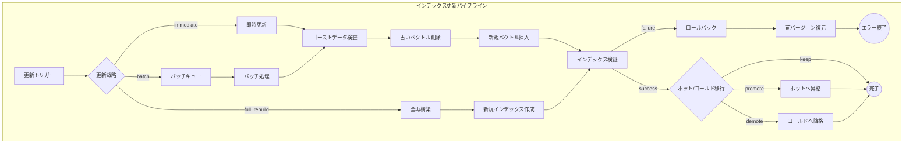
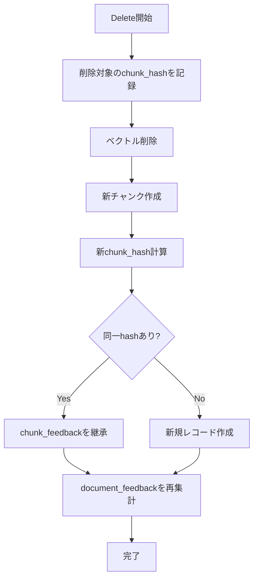

# インデックス更新パイプライン（Update Pipeline）

## パイプライン図



## 更新時の課題

- チャンク境界のズレ・文脈分断
  - 固定長チャンキングでは先頭に1文字追加されると後続の境界が全てズレる
  - 見出しやDOM構造ベースの「安定チャンキング」で変更を局所化
- ゴーストデータ（古いベクトル）によるハルシネーション
- ベクトルストアのインデックスの断片化
- 定期的なインデックス再構築が必要
- 重複データ: 既存データが検索で見つからず同一内容が重複登録される
- 部分更新: 回答の一部のみ誤りの場合、追加ではなく既存データの修正が必要
- 親子整合性: 親ドキュメントと子チャンクの整合性を保つため、親単位での全差し替えやバージョン切替が必要
- 木構造インデックスの波及効果: RAPTOR等では末端チャンクの微変更が上位の要約まで波及する（バタフライ効果）

## ノード詳細

### 更新トリガー

- リソース更新の検知
- 変更検知手法
  - mtime / ETag: ファイルシステムやHTTPヘッダーの更新日時
  - コンテンツハッシュ: 内容のハッシュ値比較
  - 構造Diff: ドキュメント構造の差分検出
  - セマンティック差分: 意味的な変更の検出
  - CDC（Change Data Capture）: データベースの変更ログ監視

### 更新戦略

| 戦略 | 説明 |
|------|------|
| `immediate` | リアルタイムで即時更新 |
| `batch` | 更新をキューに蓄積し、まとめて処理 |
| `full_rebuild` | 全再構築。整合性が取りやすくゴミデータが残りにくいが、データ量増加でコスト増 |

#### 増分更新の管理手法

- 3点セットによる差分管理
  - `doc_id`: ドキュメントの永続ID
  - `chunk_id`: チャンクの一意ID
  - `chunk_hash`: チャンク内容のハッシュ値
- 新規チャンクのみ埋め込み処理を実行
- 削除は論理削除（`is_active=false`）で安全に対応

#### 全再構築（full_rebuild）

増分更新では解消できない問題が蓄積した場合に実行する。

**実行タイミング:**
- 定期メンテナンス（例: 週次/月次）
- インデックス断片化が閾値を超えた場合
- 埋め込みモデルの変更時
- 大規模なスキーマ変更時

**処理フロー:**
1. 新規インデックスを別名で作成
2. 全ドキュメントを再チャンク・再埋め込み
3. インデックス検証（整合性チェック）
4. エイリアス切り替えでアトミックに本番反映
5. 旧インデックスを一定期間保持後削除

**注意点:**
- 処理中も旧インデックスで検索を継続（ダウンタイムなし）
- コストが高いため、頻繁な実行は避ける

### 新規ベクトル挿入

- 重複データ検出
  - 新規追加前に類似度検索で既存データを取得
  - LLMで「既に存在しているか」を判定
  - 全データではなく類似上位のみ比較（コスト削減）

### ホット/コールド移行

| アクション | 説明 |
|-----------|------|
| `promote` | コールドからホットへ昇格 |
| `demote` | ホットからコールドへ降格 |
| `keep` | 現状維持 |

### エラーハンドリング

更新処理時のエラーとその対処方針。

| ノード | エラー種別 | 対処 |
|--------|-----------|------|
| 古いベクトル削除 | 削除失敗 | ロールバック（挿入中止）、アラート |
| 新規ベクトル挿入 | 挿入失敗 | リトライ後、キューに戻して再処理 |
| インデックス検証 | 検証失敗 | ロールバック、前バージョンに復元 |
| ホット/コールド移行 | 移行失敗 | 移行スキップ、次回バッチで再試行 |

**トランザクション的な一貫性:**
- Delete → Insert は論理的に1トランザクションとして扱う
- 挿入失敗時は削除もロールバック（論理削除の場合は `is_active` を元に戻す）
- 中間状態で検索結果に影響が出ないよう、切り替えはアトミックに行う

### フィードバック継承フロー

Delete-then-Insert更新時に、フィードバックデータ（Good/Bad評価、信頼度スコア）を保持するためのフロー。



**フィードバック継承の仕組み:**

| 粒度 | 継承条件 | 継承内容 |
|------|---------|---------|
| チャンク単位 | `chunk_hash`が一致 | スコア、評価数、フィードバック種別 |
| ドキュメント単位 | `doc_id`が一致 | 集約スコア（全チャンクの加重平均として再計算） |

**2層フィードバック管理アーキテクチャ:**

```
┌─────────────────┐     ┌──────────────────────────────┐
│  ベクトルストア   │     │      フィードバックDB         │
│  (Qdrant)       │     │      (PostgreSQL等)          │
├─────────────────┤     ├──────────────────────────────┤
│ chunk_id        │     │ [chunk_feedback]             │
│ doc_id          │◄───►│   chunk_hash, score, count   │
│ embedding       │     │                              │
│ metadata        │     │ [document_feedback]          │
│                 │◄───►│   doc_id, agg_score, count   │
└─────────────────┘     └──────────────────────────────┘
```

**再集計タイミング:**
- 即時更新（`immediate`）: 更新完了後に該当ドキュメントのフィードバックを即時再集計
- バッチ更新（`batch`）: バッチ処理完了後にまとめて再集計
- 全再構築（`full_rebuild`）: 全ドキュメントのフィードバックを再集計

**注意点:**
- チャンク境界が変更されても、内容が同一（`chunk_hash`一致）であれば継承される
- 内容が変更された場合、ドキュメント単位のスコア（`document_feedback`）がフォールバックとして機能
- フィードバックDBはベクトルストアとは独立しているため、インデックス再構築の影響を受けない

**ロールバック戦略:**
- 更新前のスナップショットを保持（最低1世代）
- 重大なエラー時は前バージョンに自動復元
- 復元後はアラート発報し、手動確認を促す
