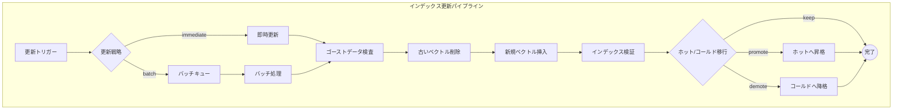

# インデックス更新パイプライン（Update Pipeline）

## パイプライン図

## 更新時の課題

- チャンク境界のズレ・文脈分断
- ゴーストデータ（古いベクトル）によるハルシネーション
- ベクトルストアのインデックスの断片化
- 定期的なインデックス再構築が必要
- 重複データ: 既存データが検索で見つからず同一内容が重複登録される
- 部分更新: 回答の一部のみ誤りの場合、追加ではなく既存データの修正が必要

## ノード詳細

### 更新トリガー

- リソース更新の検知

### 更新戦略

| 戦略 | 説明 |
|------|------|
| `immediate` | リアルタイムで即時更新 |
| `batch` | 更新をキューに蓄積し、まとめて処理 |

### 新規ベクトル挿入

- 重複データ検出
  - 新規追加前に類似度検索で既存データを取得
  - LLMで「既に存在しているか」を判定
  - 全データではなく類似上位のみ比較（コスト削減）

### ホット/コールド移行

| アクション | 説明 |
|-----------|------|
| `promote` | コールドからホットへ昇格 |
| `demote` | ホットからコールドへ降格 |
| `keep` | 現状維持 |
