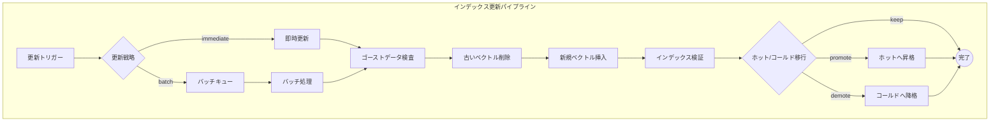

# インデックス更新パイプライン（Update Pipeline）

## パイプライン図

## 更新時の課題

- チャンク境界のズレ・文脈分断
  - 固定長チャンキングでは先頭に1文字追加されると後続の境界が全てズレる
  - 見出しやDOM構造ベースの「安定チャンキング」で変更を局所化
- ゴーストデータ（古いベクトル）によるハルシネーション
- ベクトルストアのインデックスの断片化
- 定期的なインデックス再構築が必要
- 重複データ: 既存データが検索で見つからず同一内容が重複登録される
- 部分更新: 回答の一部のみ誤りの場合、追加ではなく既存データの修正が必要
- 親子整合性: 親ドキュメントと子チャンクの整合性を保つため、親単位での全差し替えやバージョン切替が必要
- 木構造インデックスの波及効果: RAPTOR等では末端チャンクの微変更が上位の要約まで波及する（バタフライ効果）

## ノード詳細

### 更新トリガー

- リソース更新の検知
- 変更検知手法
  - mtime / ETag: ファイルシステムやHTTPヘッダーの更新日時
  - コンテンツハッシュ: 内容のハッシュ値比較
  - 構造Diff: ドキュメント構造の差分検出
  - セマンティック差分: 意味的な変更の検出
  - CDC（Change Data Capture）: データベースの変更ログ監視

### 更新戦略

| 戦略 | 説明 |
|------|------|
| `immediate` | リアルタイムで即時更新 |
| `batch` | 更新をキューに蓄積し、まとめて処理 |
| `full_rebuild` | 全再構築。整合性が取りやすくゴミデータが残りにくいが、データ量増加でコスト増 |

#### 増分更新の管理手法

- 3点セットによる差分管理
  - `doc_id`: ドキュメントの永続ID
  - `chunk_id`: チャンクの一意ID
  - `chunk_hash`: チャンク内容のハッシュ値
- 新規チャンクのみ埋め込み処理を実行
- 削除は論理削除（`is_active=false`）で安全に対応

### 新規ベクトル挿入

- 重複データ検出
  - 新規追加前に類似度検索で既存データを取得
  - LLMで「既に存在しているか」を判定
  - 全データではなく類似上位のみ比較（コスト削減）

### ホット/コールド移行

| アクション | 説明 |
|-----------|------|
| `promote` | コールドからホットへ昇格 |
| `demote` | ホットからコールドへ降格 |
| `keep` | 現状維持 |
